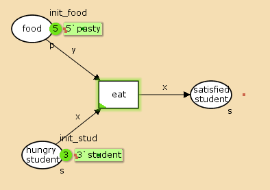
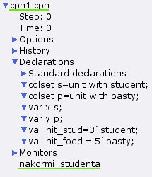
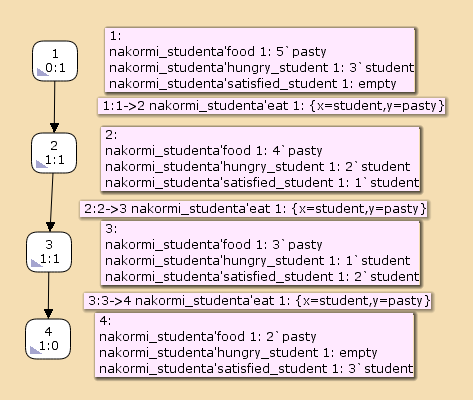

---
## Front matter
lang: ru-RU
title: Лабораторная работа 9
## subtitle: Простейший шаблон
author:
  - Тагиев Б. А.
institute:
  - Российский университет дружбы народов, Москва, Россия
date: 25 апреля 2023

## i18n babel
babel-lang: russian
babel-otherlangs: english

## Formatting pdf
toc: false
toc-title: Содержание
figureTitle: "Рис."
slide_level: 2
aspectratio: 169
section-titles: true
theme: metropolis
mainfont: DejaVu Serif
romanfont: DejaVu Serif
sansfont: DejaVu Sans
monofont: DejaVu Sans Mono
header-includes:
 - \metroset{progressbar=frametitle,sectionpage=progressbar,numbering=fraction}
 - '\makeatletter'
 - '\beamer@ignorenonframefalse'
 - '\makeatother'
---

## Цель работы

Рассмотрим пример студентов, обедающих пирогами. Голодный студент становится сытым после того, как съедает пирог. Таким образом, имеем:

 – два типа фишек: «пироги» и «студенты»;

 – три позиции: «голодный студент», «пирожки», «сытый студент»;

 – один переход: «съесть пирожок».

## Выполнение лабораторной работы

1. Рисуем граф сети. Для этого с помощью контекстного меню создаём новую сеть, добавляем позиции, переход и дуги:

{width=30%}

## Выполнение лабораторной работы

:::::::::::::: {.columns align=center}
::: {.column width="30%"}

2. Зададим декларации модель "Накорми студентов".

:::
::: {.column width="70%"}

{width=40%}

:::
::::::::::::::

## Выполнение лабораторной работы

:::::::::::::: {.columns align=center}
::: {.column width="50%"}

3. Запустив получим результат - наши голодные студенты поели и стали сытыми, а количество пирожков уменьшилось. Можем просмотреть отчет о пространстве состояний.

:::
::: {.column width="50%"}

```
State Space
  Nodes:  4
  Arcs:   3
  Secs:   0
  Status: Full

Scc Graph
  Nodes:  4
  Arcs:   3
  Secs:   0
```

:::
::::::::::::::

## Выполнение лабораторной работы

4. В том же файле статистки мы можем найти максимальные и минимальные состояния для наших мультисетов и отдельных значений

```
Best Integer Bounds
                                            Upper      Lower
     nakormi_studenta'food 1                5          2
     nakormi_studenta'hungry_student 1      3          0
     nakormi_studenta'satisfied_student 1   3          0

```

## Выполнение лабораторной работы

```
Best Upper Multi-set Bounds
     nakormi_studenta'food 1                5`pasty
     nakormi_studenta'hungry_student 1      3`student
     nakormi_studenta'satisfied_student 1   3`student
```

## Выполнение лабораторной работы

```
Best Lower Multi-set Bounds
     nakormi_studenta'food 1                2`pasty
     nakormi_studenta'hungry_student 1      empty
     nakormi_studenta'satisfied_student 1   empty
```

## Выполнение лабораторной работы

5. Построим граф пространства состояний.

{width=45%}

## Выводы

Во время выполнения лабораторной работы, я провел моделирование \`модели\` "Накорми студентов", создал отчет и граф пространства состояний.
