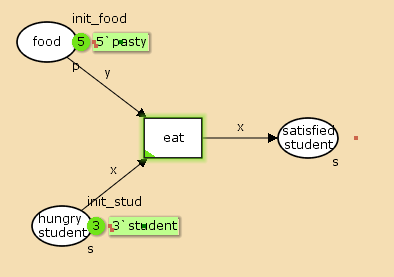
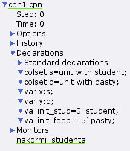
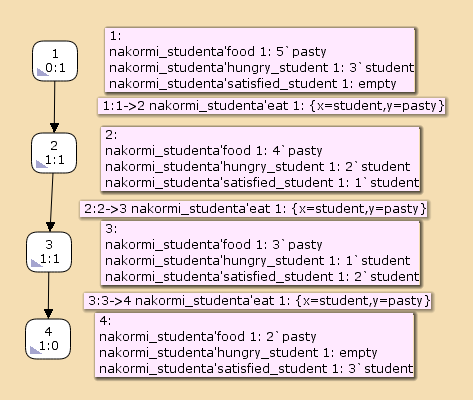

---
## Front matter
title: "Лабораторная работа 9"
##subtitle: "Простейший вариант"
author: "Тагиев Байрам Алтай оглы"

## Generic otions
lang: ru-RU
toc-title: "Содержание"

## Bibliography
bibliography: bib/cite.bib
csl: pandoc/csl/gost-r-7-0-5-2008-numeric.csl

## Pdf output format
toc: true # Table of contents
toc-depth: 2
lof: true # List of figures
lot: true # List of tables
fontsize: 12pt
linestretch: 1.5
papersize: a4
documentclass: scrreprt
## I18n polyglossia
polyglossia-lang:
  name: russian
  options:
	- spelling=modern
	- babelshorthands=true
polyglossia-otherlangs:
  name: english
## I18n babel
babel-lang: russian
babel-otherlangs: english
## Fonts
mainfont: DejaVu Serif
romanfont: DejaVu Serif
sansfont: DejaVu Sans
monofont: DejaVu Sans Mono
mainfontoptions: Ligatures=TeX
romanfontoptions: Ligatures=TeX
sansfontoptions: Ligatures=TeX,Scale=MatchLowercase
monofontoptions: Scale=MatchLowercase,Scale=0.9
## Pandoc-crossref LaTeX customization
figureTitle: "Рис."
tableTitle: "Таблица"
listingTitle: "Листинг"
lofTitle: "Список иллюстраций"
lotTitle: "Список таблиц"
lolTitle: "Листинги"
## Misc options
indent: true
header-includes:
  - \usepackage{indentfirst}
  - \usepackage{float} # keep figures where there are in the text
  - \floatplacement{figure}{H} # keep figures where there are in the text 
  - \usepackage{pdflscape}
  - \newcommand{\blandscape}{\begin{landscape}}
  - \newcommand{\elandscape}{\end{landscape}}
  - \usepackage{caption}
  - \captionsetup[figure]{
      name=,
      labelsep=none,
      labelformat=empty
    }
---

# Цель работы

Рассмотрим пример студентов, обедающих пирогами. Голодный студент становится сытым после того, как съедает пирог. Таким образом, имеем:

 – два типа фишек: «пироги» и «студенты»;
 
 – три позиции: «голодный студент», «пирожки», «сытый студент»;

 – один переход: «съесть пирожок».

# Выполнение лабораторной работы

1. Рисуем граф сети. Для этого с помощью контекстного меню создаём новую сеть, добавляем позиции, переход и дуги:

{width=70%}

2. Зададим декларации модель "Накорми студентов".

{width=70%}

3. Запустив получим результат - наши голодные студенты поели и стали сытыми, а количество пирожков уменьшилось. Можем просмотреть отчет о пространстве состояний.

```
State Space
  Nodes:  4
  Arcs:   3
  Secs:   0
  Status: Full

Scc Graph
  Nodes:  4
  Arcs:   3
  Secs:   0
```

4. В том же файле статистки мы можем найти максимальные и минимальные состояния для наших мультисетов и отдельных значений

```
Best Integer Bounds
					    Upper      Lower
     nakormi_studenta'food 1		    5          2
     nakormi_studenta'hungry_student 1	    3          0
     nakormi_studenta'satisfied_student 1   3          0

Best Upper Multi-set Bounds
     nakormi_studenta'food 1		    5`pasty
     nakormi_studenta'hungry_student 1	    3`student
     nakormi_studenta'satisfied_student 1   3`student

Best Lower Multi-set Bounds
     nakormi_studenta'food 1                2`pasty
     nakormi_studenta'hungry_student 1      empty
     nakormi_studenta'satisfied_student 1   empty
```

5. Построим граф пространства состояний.

{width=70%}

# Выводы

Во время выполнения лабораторной работы, я провел моделирование \`модели\` "Накорми студентов", создал отчет и граф пространства состояний.
