---
## Front matter
lang: ru-RU
title: Лабораторная работа 11
## subtitle: Простейший шаблон
author:
  - Тагиев Б. А.
institute:
  - Российский университет дружбы народов, Москва, Россия
date: 26 апреля 2023

## i18n babel
babel-lang: russian
babel-otherlangs: english

## Formatting pdf
toc: false
toc-title: Содержание
figureTitle: "Рис."
slide_level: 2
aspectratio: 169
section-titles: true
theme: metropolis
mainfont: DejaVu Serif
romanfont: DejaVu Serif
sansfont: DejaVu Sans
monofont: DejaVu Sans Mono
header-includes:
 - \metroset{progressbar=frametitle,sectionpage=progressbar,numbering=fraction}
 - '\makeatletter'
 - '\beamer@ignorenonframefalse'
 - '\makeatother'
---

## Цель работы

В систему поступает поток заявок двух типов, распределённый по пуассоновскому закону. Заявки поступают в очередь сервера на обработку. Дисциплина очереди - FIFO. Если сервер находится в режиме ожидания (нет заявок на сервере), то заявка поступает на обработку сервером.

## Выполнение лабораторной работы

1. Рисуем граф сети.

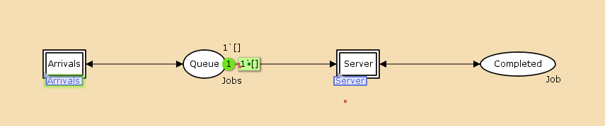{width=50%}

## Выполнение лабораторной работы

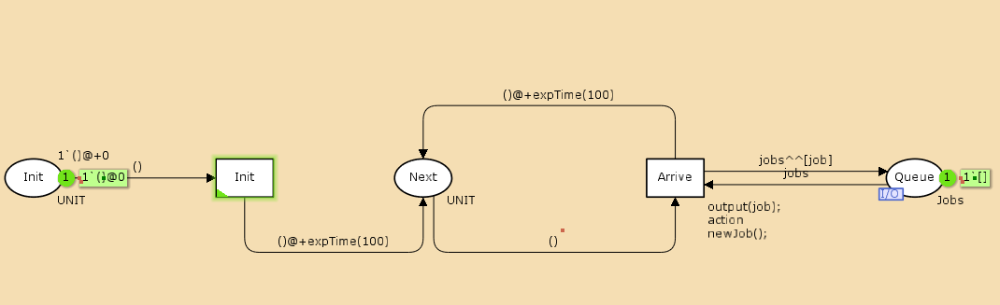{width=50%}

## Выполнение лабораторной работы

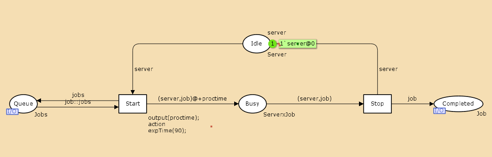{width=50%}

## Выполнение лабораторной работы

2. Зададим декларации модель.

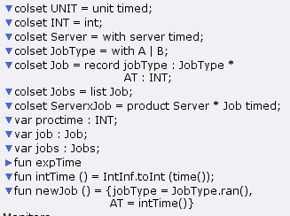{width=50%}

## Выполнение лабораторной работы

3. Если прокрутить моделирование, то сможешь увидеть как пакеты поступают в систему и обрабатываются.

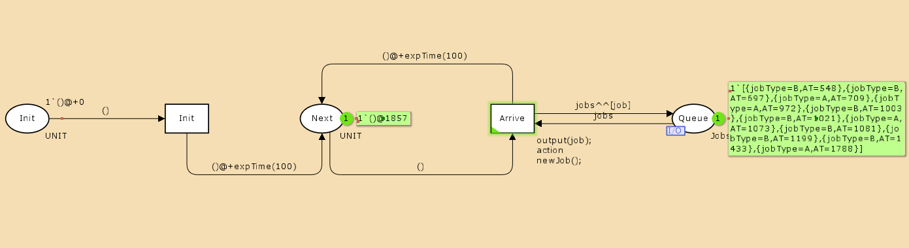{width=50%}

## Выполнение лабораторной работы

4. Добавим мониторы. Изменим предикат, задав число шагов, через которое будем останавливать мониторинг.

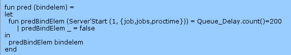{width=50%}

## Выполнение лабораторной работы

5. Добавим Data call.

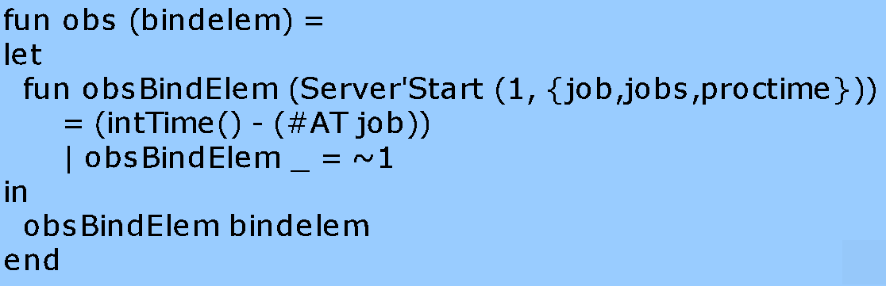{width=50%}

## Выполнение лабораторной работы

6. Запустив, мы получим log файл, при помощи которого мы можем построить график изменения задержки в очереди.

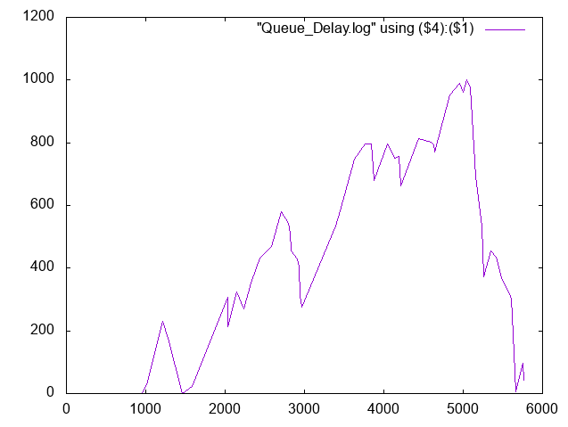{width=50%}

## Выполнение лабораторной работы

7. Посчитаем задержку в действительных значениях. С помощью палитры Monitoring выбираем Data Call и устанавливаем на переходе Start. Появившийся в меню монитор называем Queue Delay Real.

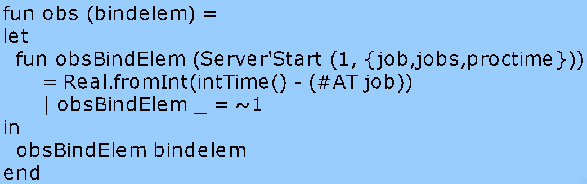{width=50%}

## Выполнение лабораторной работы

8. Запустив, мы получим log файл, при помощи которого мы можем построить график изменения задержки в очереди.

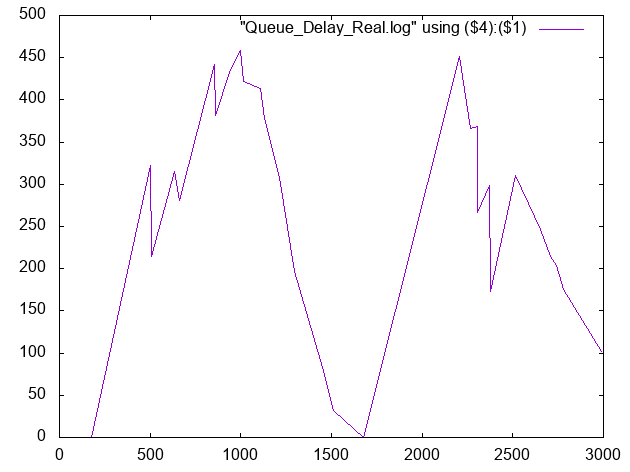{width=50%}

## Выполнение лабораторной работы

9. Посчитаем, сколько раз задержка превысила заданное значение. С помощью палит- ры Monitoring выбираем Data Call и устанавливаем на переходе Start. Монитор называем Long Delay Time.

## Выполнение лабораторной работы

10. Запустив, мы получим log файл, при помощи которого мы можем построить график изменения задержки в очереди.

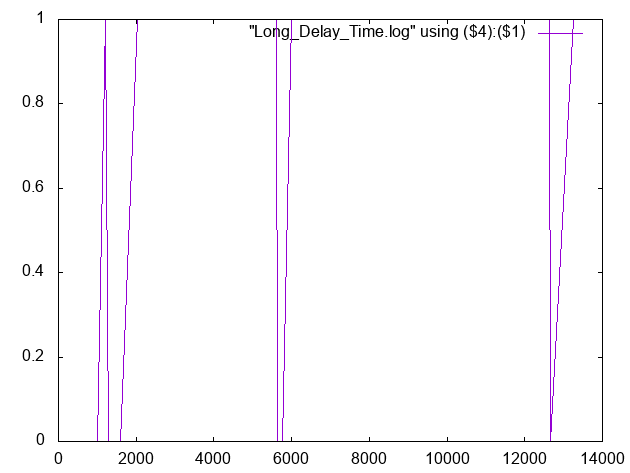{width=50%}

## Выводы

Во время выполнения лабораторной работы, я провел моделирование M|M|1.
