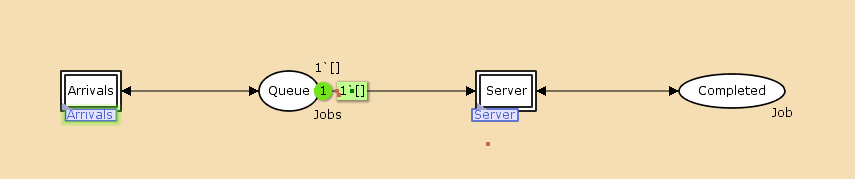
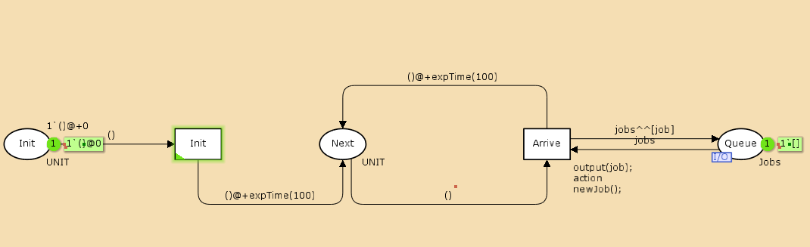
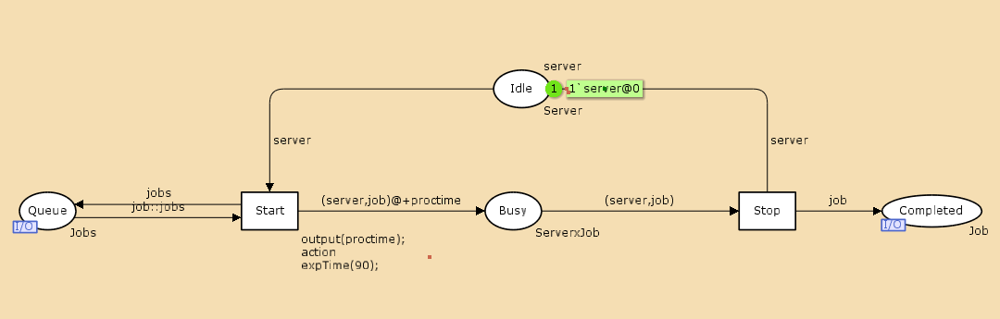
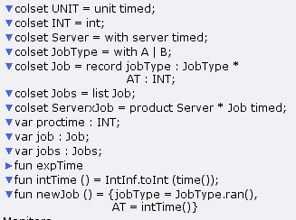
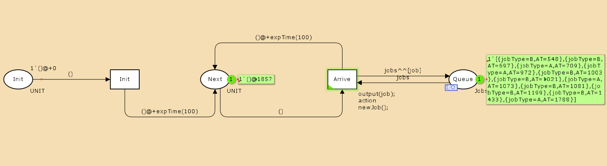
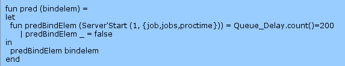
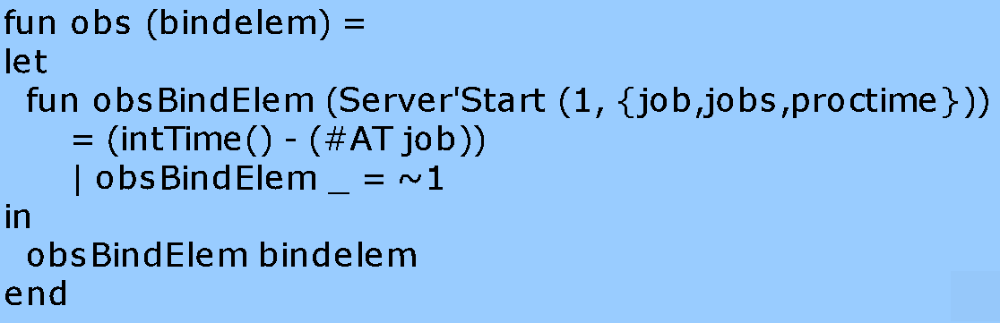
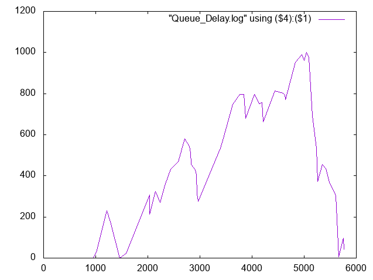
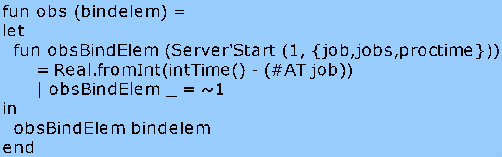
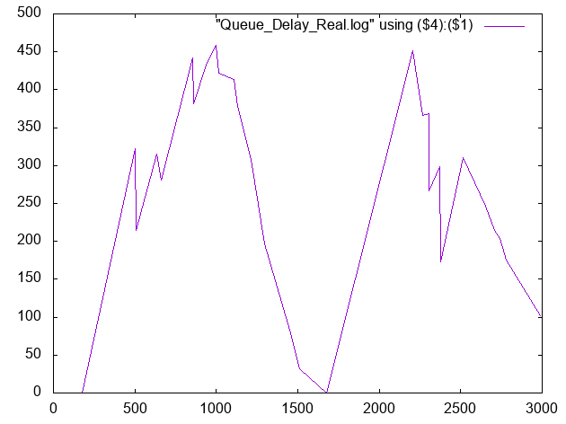

---
## Front matter
title: "Лабораторная работа 11"
##subtitle: "Простейший вариант"
author: "Тагиев Байрам Алтай оглы"

## Generic otions
lang: ru-RU
toc-title: "Содержание"

## Bibliography
bibliography: bib/cite.bib
csl: pandoc/csl/gost-r-7-0-5-2008-numeric.csl

## Pdf output format
toc: true # Table of contents
toc-depth: 2
lof: true # List of figures
lot: true # List of tables
fontsize: 12pt
linestretch: 1.5
papersize: a4
documentclass: scrreprt
## I18n polyglossia
polyglossia-lang:
  name: russian
  options:
	- spelling=modern
	- babelshorthands=true
polyglossia-otherlangs:
  name: english
## I18n babel
babel-lang: russian
babel-otherlangs: english
## Fonts
mainfont: DejaVu Serif
romanfont: DejaVu Serif
sansfont: DejaVu Sans
monofont: DejaVu Sans Mono
mainfontoptions: Ligatures=TeX
romanfontoptions: Ligatures=TeX
sansfontoptions: Ligatures=TeX,Scale=MatchLowercase
monofontoptions: Scale=MatchLowercase,Scale=0.9
## Pandoc-crossref LaTeX customization
figureTitle: "Рис."
tableTitle: "Таблица"
listingTitle: "Листинг"
lofTitle: "Список иллюстраций"
lotTitle: "Список таблиц"
lolTitle: "Листинги"
## Misc options
indent: true
header-includes:
  - \usepackage{indentfirst}
  - \usepackage{float} # keep figures where there are in the text
  - \floatplacement{figure}{H} # keep figures where there are in the text 
  - \usepackage{pdflscape}
  - \newcommand{\blandscape}{\begin{landscape}}
  - \newcommand{\elandscape}{\end{landscape}}
  - \usepackage{caption}
  - \captionsetup[figure]{
      name=,
      labelsep=none,
      labelformat=empty
    }
---

# Цель работы

В систему поступает поток заявок двух типов, распределённый по пуассоновскому закону. Заявки поступают в очередь сервера на обработку. Дисциплина очереди - FIFO. Если сервер находится в режиме ожидания (нет заявок на сервере), то заявка поступает на обработку сервером.

# Выполнение лабораторной работы

1. Рисуем граф сети. 

{width=70%}

{width=70%}

{width=70%}

2. Зададим декларации модель.

{width=70%}

3. Если прокрутить моделирование, то сможешь увидеть как пакеты поступают в систему и обрабатываются.

{width=70%}

4. Добавим мониторы. Изменим предикат, задав число шагов, через которое будем останавливать мониторинг.

{width=70%}

5. Добавим Data call.

{width=70%}

6. Запустив, мы получим log файл, при помощи которого мы можем построить график изменения задержки в очереди.

{width=70%}

7. Посчитаем задержку в действительных значениях. С помощью палитры Monitoring выбираем Data Call и устанавливаем на переходе Start. Появившийся в меню монитор называем Queue Delay Real.

{width=70%}

8. Запустив, мы получим log файл, при помощи которого мы можем построить график изменения задержки в очереди.

{width=70%}

9. Посчитаем, сколько раз задержка превысила заданное значение. С помощью палит- ры Monitoring выбираем Data Call и устанавливаем на переходе Start. Монитор называем Long Delay Time.

10. Запустив, мы получим log файл, при помощи которого мы можем построить график изменения задержки в очереди.

{width=70%}

# Выводы

Во время выполнения лабораторной работы, я провел моделирование M|M|1.
