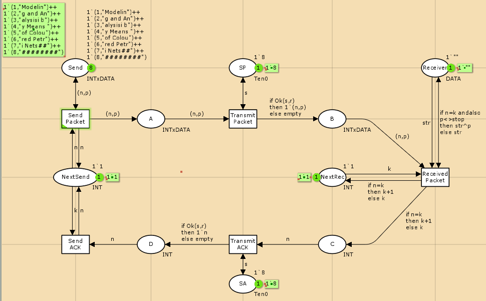
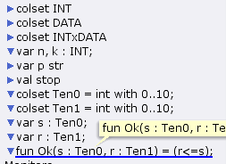
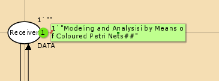
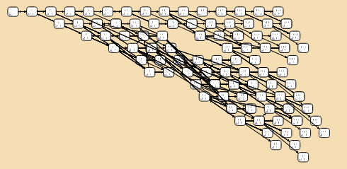

---
## Front matter
lang: ru-RU
title: Лабораторная работа 12
## subtitle: Простейший шаблон
author:
  - Тагиев Б. А.
institute:
  - Российский университет дружбы народов, Москва, Россия
date: 26 апреля 2023

## i18n babel
babel-lang: russian
babel-otherlangs: english

## Formatting pdf
toc: false
toc-title: Содержание
figureTitle: "Рис."
slide_level: 2
aspectratio: 169
section-titles: true
theme: metropolis
mainfont: DejaVu Serif
romanfont: DejaVu Serif
sansfont: DejaVu Sans
monofont: DejaVu Sans Mono
header-includes:
 - \metroset{progressbar=frametitle,sectionpage=progressbar,numbering=fraction}
 - '\makeatletter'
 - '\beamer@ignorenonframefalse'
 - '\makeatother'
---

## Цель работы

Рассмотрим ненадёжную сеть передачи данных, состоящую из источника, получателя. Перед отправкой очередной порции данных источник должен получить от полу- чателя подтверждение о доставке предыдущей порции данных. Считаем, что пакет состоит из номера пакета и строковых данных. Передавать будем сообщение «Modelling and Analysis by Means of Coloured Petry Nets», разбитое по 8 символов.

## Выполнение лабораторной работы

1. Рисуем граф сети.

{width=70%}

## Выполнение лабораторной работы

2. Зададим декларации модель.

{width=70%}

## Выполнение лабораторной работы

3. Запустив, получим результат - пакет дошел до Receiver.

{width=70%}

## Выполнение лабораторной работы

4. Сформируем отчёт о пространстве состояний.

## Выполнение лабораторной работы

```
State Space
  Nodes:  6443
  Arcs:   91940
  Secs:   10
  Status: Partial

Scc Graph
  Nodes:  3375
  Arcs:   74704
  Secs:   1
```

## Выполнение лабораторной работы

5. Также построим граф пространства состояний.

{width=70%}

## Выводы

Мы смоделировали простой протокол передачи данных.
