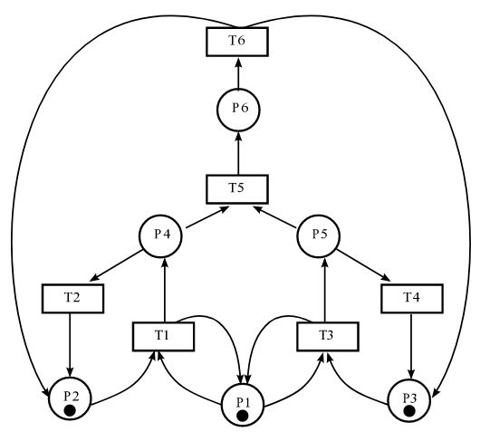
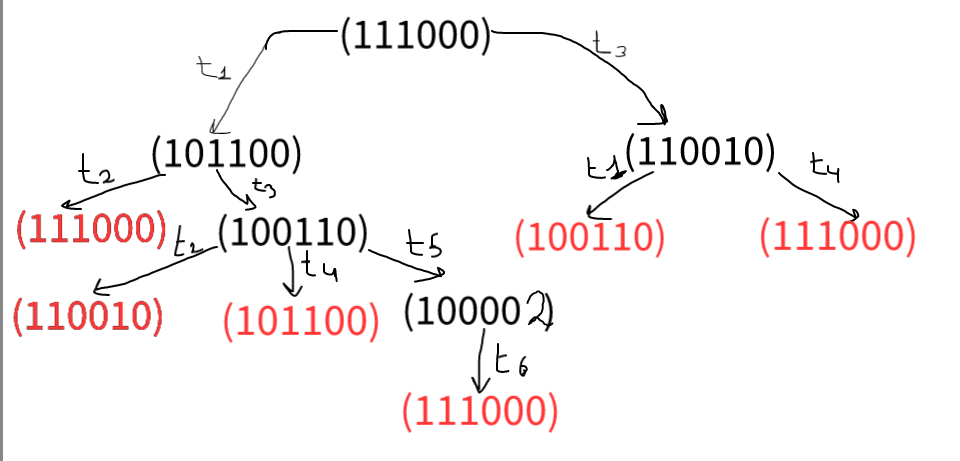
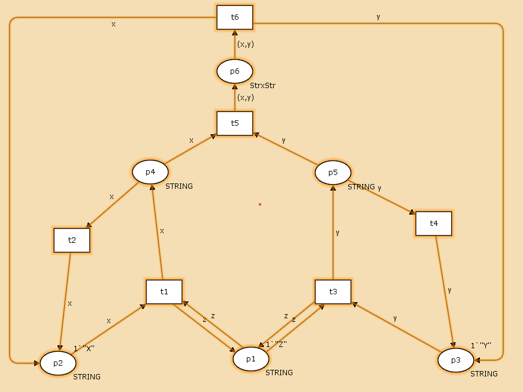
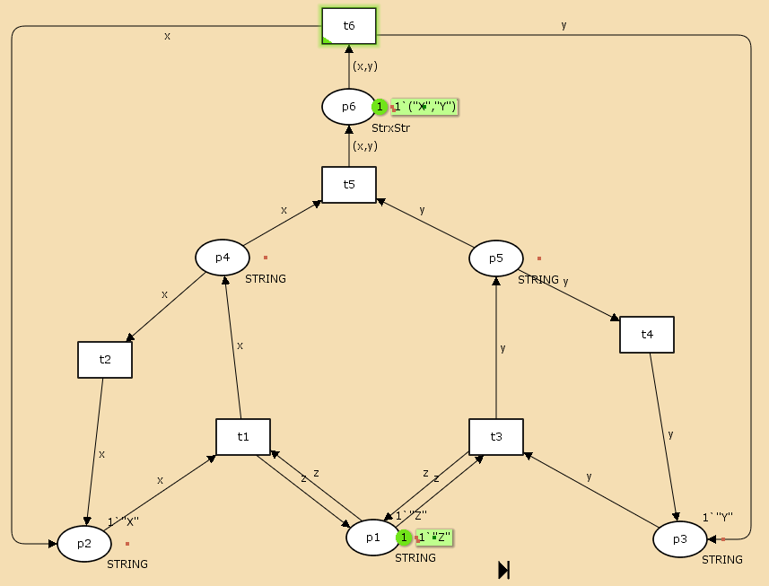
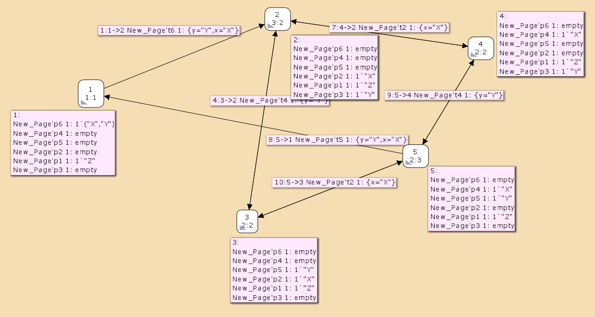

---
## Front matter
lang: ru-RU
title: Лабораторная работа 13
## subtitle: Простейший шаблон
author:
  - Тагиев Б. А.
institute:
  - Российский университет дружбы народов, Москва, Россия
date: 3 мая 2023

## i18n babel
babel-lang: russian
babel-otherlangs: english

## Formatting pdf
toc: false
toc-title: Содержание
figureTitle: "Рис."
slide_level: 2
aspectratio: 169
section-titles: true
theme: metropolis
mainfont: DejaVu Serif
romanfont: DejaVu Serif
sansfont: DejaVu Sans
monofont: DejaVu Sans Mono
header-includes:
 - \metroset{progressbar=frametitle,sectionpage=progressbar,numbering=fraction}
 - '\makeatletter'
 - '\beamer@ignorenonframefalse'
 - '\makeatother'
---

## Цель работы

1. Используя теоретические методы анализа сетей Петри, проведите анализ сети (с помощью построения дерева достижимости). Определите, является ли сеть безопасной, ограниченной, сохраняющей, имеются ли тупики.

2. Промоделируйте сеть Петри с помощью CPNTools.

3. Вычислите пространство состояний. Сформируйте отчёт о пространстве состояний и проанализируйте его. Постройте граф пространства состояний.

## Выполнение лабораторной работы

1. Наша сеть будет выглядеть следующим образом.

{width=30%}

## Выполнение лабораторной работы

2. Построим дерево достижимости для данной сети.

{width=60%}

## Выполнение лабораторной работы

3. Проведем анализ сети Петри:

 - данная сеть Петри небезопасна, т. к. во позициях может быть более одной фишки
 - НЕ строго сохраняющая сеть, т. к. количество входящих и исходящих переходов изменяется
 - сеть $k$-ограниченная
 - в сети нет тупиков, т. к. все переходы доступны.

## Выполнение лабораторной работы

4. Перейдем к построению на CPNTools. Откроем и построим сеть.

{width=60%}

## Выполнение лабораторной работы

5. Запустим и увидим как работает наша сеть.

{width=40%}

## Выполнение лабораторной работы

6. Построим граф пространства состояний.

{width=40%}

## Выполнение лабораторной работы

7. Сформируем отчет о пространстве состояния.

```
  State Space
     Nodes:  5
     Arcs:   10
     Secs:   0
     Status: Full
```

## Выполнение лабораторной работы

Здесь мы наблюдаем то, что наша сеть небезопасна, т. к. имеет больше 1 фишки на $p6$.

```
  Best Upper Multi-set Bounds
     New_Page'p1 1       1`"Z"
     New_Page'p2 1       1`"X"
     New_Page'p3 1       1`"Y"
     New_Page'p4 1       1`"X"
     New_Page'p5 1       1`"Y"
     New_Page'p6 1       1`("X","Y")
```

## Выводы

В результате выполнения данной работы я провел моделирование сети Петри при помощи CPNTools.
