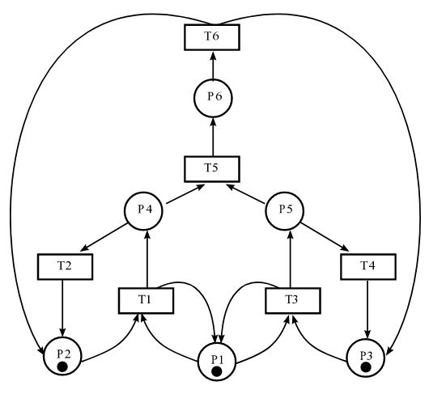
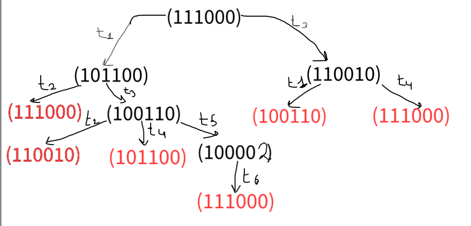
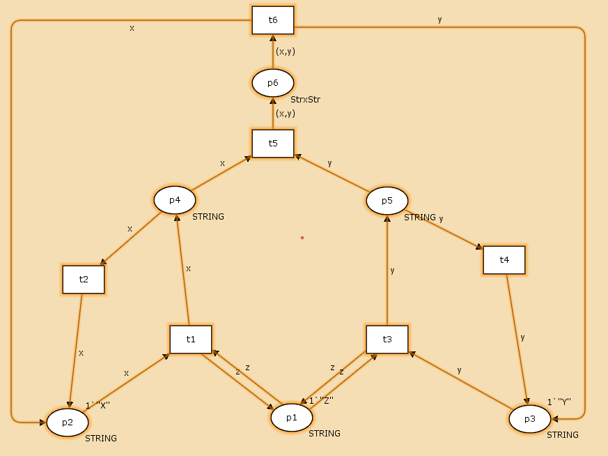
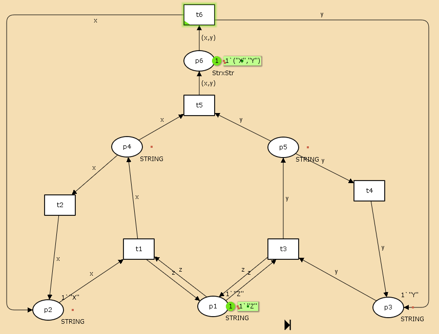
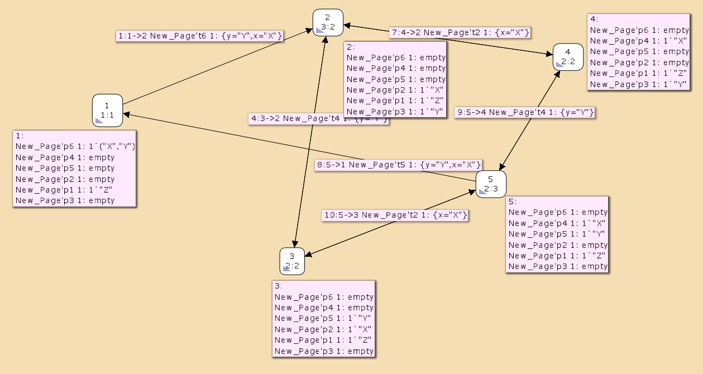

---
## Front matter
title: "Лабораторная работа 13"
##subtitle: "Простейший вариант"
author: "Тагиев Байрам Алтай оглы"

## Generic otions
lang: ru-RU
toc-title: "Содержание"

## Bibliography
bibliography: bib/cite.bib
csl: pandoc/csl/gost-r-7-0-5-2008-numeric.csl

## Pdf output format
toc: true # Table of contents
toc-depth: 2
lof: true # List of figures
lot: true # List of tables
fontsize: 12pt
linestretch: 1.5
papersize: a4
documentclass: scrreprt
## I18n polyglossia
polyglossia-lang:
  name: russian
  options:
	- spelling=modern
	- babelshorthands=true
polyglossia-otherlangs:
  name: english
## I18n babel
babel-lang: russian
babel-otherlangs: english
## Fonts
mainfont: DejaVu Serif
romanfont: DejaVu Serif
sansfont: DejaVu Sans
monofont: DejaVu Sans Mono
mainfontoptions: Ligatures=TeX
romanfontoptions: Ligatures=TeX
sansfontoptions: Ligatures=TeX,Scale=MatchLowercase
monofontoptions: Scale=MatchLowercase,Scale=0.9
## Pandoc-crossref LaTeX customization
figureTitle: "Рис."
tableTitle: "Таблица"
listingTitle: "Листинг"
lofTitle: "Список иллюстраций"
lotTitle: "Список таблиц"
lolTitle: "Листинги"
## Misc options
indent: true
header-includes:
  - \usepackage{indentfirst}
  - \usepackage{float} # keep figures where there are in the text
  - \floatplacement{figure}{H} # keep figures where there are in the text 
  - \usepackage{pdflscape}
  - \newcommand{\blandscape}{\begin{landscape}}
  - \newcommand{\elandscape}{\end{landscape}}
  - \usepackage{caption}
  - \captionsetup[figure]{
      name=,
      labelsep=none,
      labelformat=empty
    }
---

# Цель работы

1. Используя теоретические методы анализа сетей Петри, проведите анализ сети (с помощью построения дерева достижимости). Определите, является ли сеть безопасной, ограниченной, сохраняющей, имеются ли тупики.

2. Промоделируйте сеть Петри с помощью CPNTools.

3. Вычислите пространство состояний. Сформируйте отчёт о пространстве состояний и проанализируйте его. Постройте граф пространства состояний.

# Выполнение лабораторной работы

1. Наша сеть будет выглядеть следующим образом.

{width=60%}

2. Построим дерево достижимости для данной сети.

{width=60%}

3. Проведем анализ сети Петри:

 - данная сеть Петри небезопасна, т. к. во позициях может быть более одной фишки
 - НЕ строго сохраняющая сеть, т. к. количество входящих и исходящих переходов изменяется
 - сеть $k$-ограниченная
 - в сети нет тупиков, т. к. все переходы доступны.

4. Перейдем к построению на CPNTools. Откроем и построим сеть.

{width=60%}

5. Запустим и увидим как работает наша сеть.

{width=60%}

6. Построим граф пространства состояний.

{width=60%}

7. Сформируем отчет о пространстве состояния.

```
  State Space
     Nodes:  5
     Arcs:   10
     Secs:   0
     Status: Full
```

Здесь мы наблюдаем то, что наша сеть небезопасна, т. к. имеет больше 1 фишки на $p6$.

```
  Best Upper Multi-set Bounds
     New_Page'p1 1       1`"Z"
     New_Page'p2 1       1`"X"
     New_Page'p3 1       1`"Y"
     New_Page'p4 1       1`"X"
     New_Page'p5 1       1`"Y"
     New_Page'p6 1       1`("X","Y")
```

# Выводы

В результате выполнения данной работы я провел моделирование сети Петри при помощи CPNTools.
