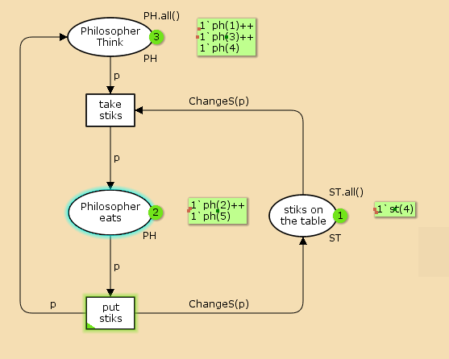
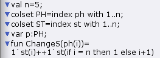
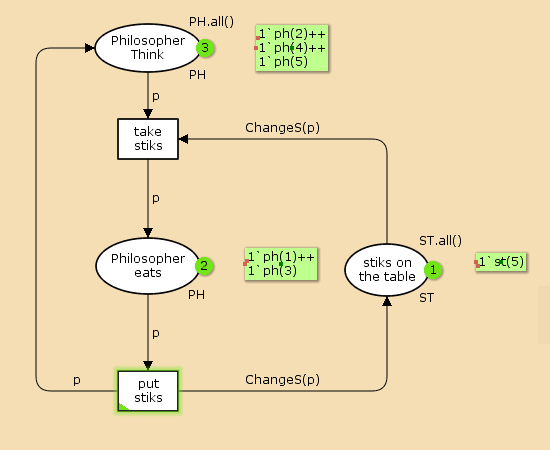
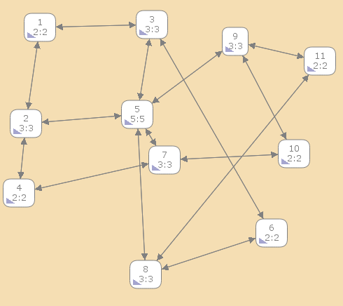

---
## Front matter
lang: ru-RU
title: Лабораторная работа 10
## subtitle: Простейший шаблон
author:
  - Тагиев Б. А.
institute:
  - Российский университет дружбы народов, Москва, Россия
date: 26 апреля 2023

## i18n babel
babel-lang: russian
babel-otherlangs: english

## Formatting pdf
toc: false
toc-title: Содержание
figureTitle: "Рис."
slide_level: 2
aspectratio: 169
section-titles: true
theme: metropolis
mainfont: DejaVu Serif
romanfont: DejaVu Serif
sansfont: DejaVu Sans
monofont: DejaVu Sans Mono
header-includes:
 - \metroset{progressbar=frametitle,sectionpage=progressbar,numbering=fraction}
 - '\makeatletter'
 - '\beamer@ignorenonframefalse'
 - '\makeatother'
---

## Цель работы

Пять мудрецов сидят за круглым столом и могут пребывать в двух состояниях — думать и есть. Между соседями лежит одна палочка для еды. Для приёма пищи необходимы две палочки. Палочки — пересекающийся ресурс. Необходимо синхронизировать процесс еды так, чтобы мудрецы не умерли с голода.

## Выполнение лабораторной работы

1. Рисуем граф сети. Для этого с помощью контекстного меню создаём новую сеть, добавляем позиции, переход и дуги:

{width=40%}

## Выполнение лабораторной работы

2. Зададим декларации модель.

{width=40%}

## Выполнение лабораторной работы

3. Если прокрутить моделирование, то сможешь увидеть как циклично кушают философы.

{width=40%}

## Выполнение лабораторной работы

4. Запустив получим результат - наши философы поочередно кушают, а количество палочек, в зависимости о тех, кто кушает - изменяется. Можем просмотреть отчет о пространстве состояний.

## Выполнение лабораторной работы

```
  State Space
     Nodes:  11
     Arcs:   30
     Secs:   0
     Status: Full

  Scc Graph
     Nodes:  1
     Arcs:   0
     Secs:   0
```

## Выполнение лабораторной работы

5. Построим граф пространства состояний.

{width=40%}

## Выводы

Во время выполнения лабораторной работы, я провел моделирование задачи о обедающих мудрецах, создал отчет и граф пространства состояний.
