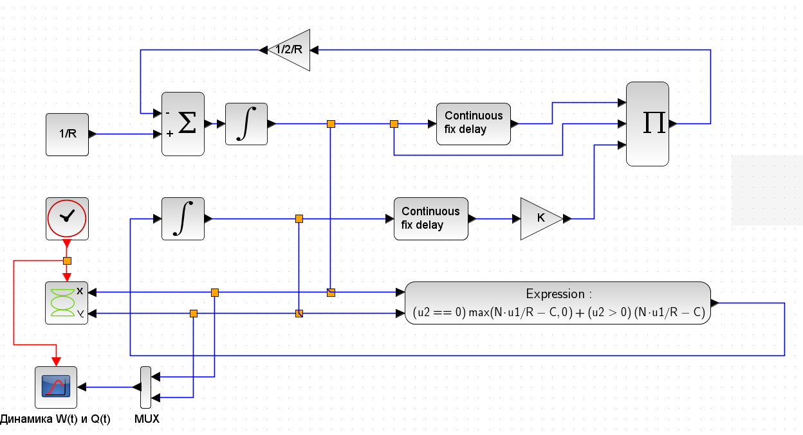

---
## Front matter
lang: ru-RU
title: Лабораторная работа 8
## subtitle: Простейший шаблон
author:
  - Тагиев Б. А.
institute:
  - Российский университет дружбы народов, Москва, Россия
date: 20 апреля 2023

## i18n babel
babel-lang: russian
babel-otherlangs: english

## Formatting pdf
toc: false
toc-title: Содержание
figureTitle: "Рис."
slide_level: 2
aspectratio: 169
section-titles: true
theme: metropolis
mainfont: DejaVu Serif
romanfont: DejaVu Serif
sansfont: DejaVu Sans
monofont: DejaVu Sans Mono
header-includes:
 - \metroset{progressbar=frametitle,sectionpage=progressbar,numbering=fraction}
 - '\makeatletter'
 - '\beamer@ignorenonframefalse'
 - '\makeatother'
---
## Цель работы

Целью данной работы является построение модели TCP/AQM.

## Выполнение лабораторной работы

1. Зададим переменные окружения. `N=1,R=1,K=5.3,C=1`

## Выполнение лабораторной работы

2. Сделаем блок-схему для моделирования.

{width=60%}

## Выполнение лабораторной работы

3. На рис. представлена динамика изменения размера TCP окна W(t) (сплошная линия) и размера очереди Q(t) (пунктирная линия).

{#fig:001 width=60%}

## Выполнение лабораторной работы

4. На рис. представлен фазовый портрет (W, Q), который показывает наличие автоколебаний параметров системы — фазовая траектория осциллирует вокруг своей стационарной точки.

{#fig:002 width=60%}

## Выполнение лабораторной работы

6. Перейдем к реализации на OpenModelica.

```modelica
model lab8
  parameter Real N = 1, R = 1, K = 5.3, C = 1;
  Real W(start = 0.1), Q(start = 1);
equation
  der(W) = 1/R - (W*delay(W, R)*K*delay(Q, R))/(2*R);
  if (Q == 0) then
    der(Q) = max(N*W/R - C, 0);
  else
    der(Q) = N*W/R - C;
  end if;
end lab8;
```

## Выполнение лабораторной работы

{width=80%}

## Выполнение лабораторной работы

{width=80%}

## Выводы

Мы реализовали модель "TCP/AQM" в xcos и OpenModelica.
