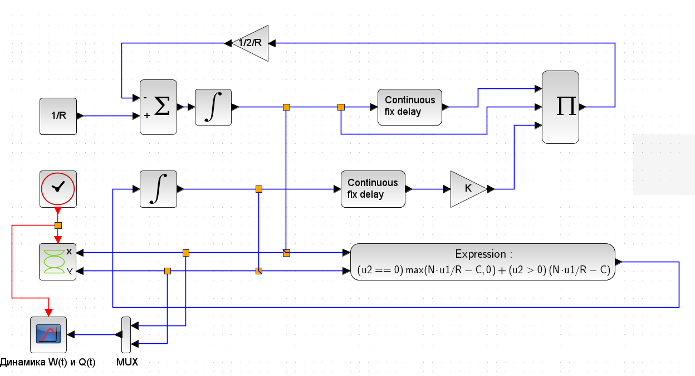

---
## Front matter
title: "Лабораторная работа 8"
##subtitle: "Простейший вариант"
author: "Тагиев Байрам Алтай оглы"

## Generic otions
lang: ru-RU
toc-title: "Содержание"

## Bibliography
bibliography: bib/cite.bib
csl: pandoc/csl/gost-r-7-0-5-2008-numeric.csl

## Pdf output format
toc: true # Table of contents
toc-depth: 2
lof: true # List of figures
lot: true # List of tables
fontsize: 12pt
linestretch: 1.5
papersize: a4
documentclass: scrreprt
## I18n polyglossia
polyglossia-lang:
  name: russian
  options:
	- spelling=modern
	- babelshorthands=true
polyglossia-otherlangs:
  name: english
## I18n babel
babel-lang: russian
babel-otherlangs: english
## Fonts
mainfont: DejaVu Serif
romanfont: DejaVu Serif
sansfont: DejaVu Sans
monofont: DejaVu Sans Mono
mainfontoptions: Ligatures=TeX
romanfontoptions: Ligatures=TeX
sansfontoptions: Ligatures=TeX,Scale=MatchLowercase
monofontoptions: Scale=MatchLowercase,Scale=0.9
## Pandoc-crossref LaTeX customization
figureTitle: "Рис."
tableTitle: "Таблица"
listingTitle: "Листинг"
lofTitle: "Список иллюстраций"
lotTitle: "Список таблиц"
lolTitle: "Листинги"
## Misc options
indent: true
header-includes:
  - \usepackage{indentfirst}
  - \usepackage{float} # keep figures where there are in the text
  - \floatplacement{figure}{H} # keep figures where there are in the text 
  - \usepackage{pdflscape}
  - \newcommand{\blandscape}{\begin{landscape}}
  - \newcommand{\elandscape}{\end{landscape}}
  - \usepackage{caption}
  - \captionsetup[figure]{
      name=,
      labelsep=none,
      labelformat=empty
    }
---

# Цель работы

Целью данной работы является построение модели TCP/AQM.

# Выполнение лабораторной работы

1. Зададим переменные окружения. `N=1,R=1,K=5.3,C=1`

2. Сделаем блок-схему для моделирования.

{width=80%}

3. На рис. @fig:001 представлена динамика изменения размера TCP окна W(t) (сплошная линия) и размера очереди Q(t) (пунктирная линия).

{#fig:001 width=80%}

4. На рис. @fig:002 представлен фазовый портрет (W, Q), который показывает наличие автоколебаний параметров системы — фазовая траектория осциллирует вокруг своей стационарной точки.

{#fig:002 width=80%}

6. Перейдем к реализации на OpenModelica. 

```modelica
model lab8
  parameter Real N = 1, R = 1, K = 5.3, C = 1;
  Real W(start = 0.1), Q(start = 1);
equation
  der(W) = 1/R - (W*delay(W, R)*K*delay(Q, R))/(2*R);
  if (Q == 0) then
    der(Q) = max(N*W/R - C, 0);
  else
    der(Q) = N*W/R - C;
  end if;
  annotation(experiment(StartTime = 0, StopTime = 100, Tolerance = 1e-06, Interval = 0.2));
end lab8;
```

{width=80%}

{width=80%}

# Выводы

Мы реализовали модель "TCP/AQM" в xcos и OpenModelica.


